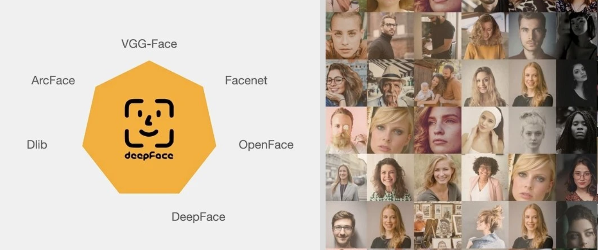

# Face_Recognition_with_Deepface_package
Face recognition with deepface package on PersianFace dataset


## Description
We used generate_dataset function to convert images to feature vectors using deepface package.
Then we Implement a Multi-Layer Perceptron (MLP) neural network model and train it on the dataset.

## How to install
```pip install -r requirements.txt```
## How to run
run the below code

```python generate_dataset.py```
## Loss and accuracy
